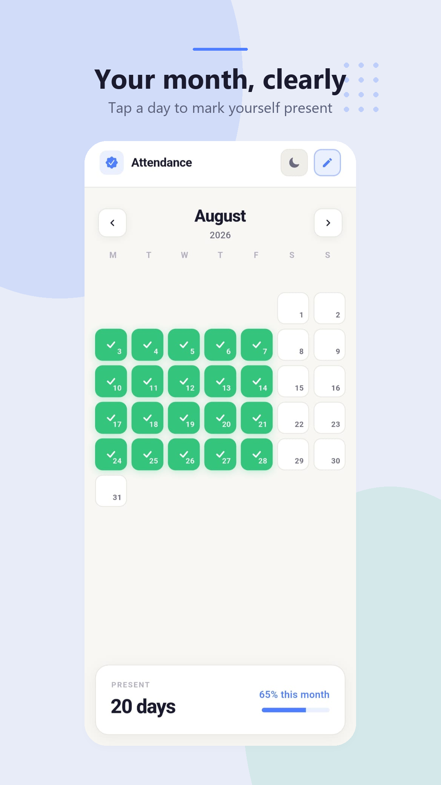
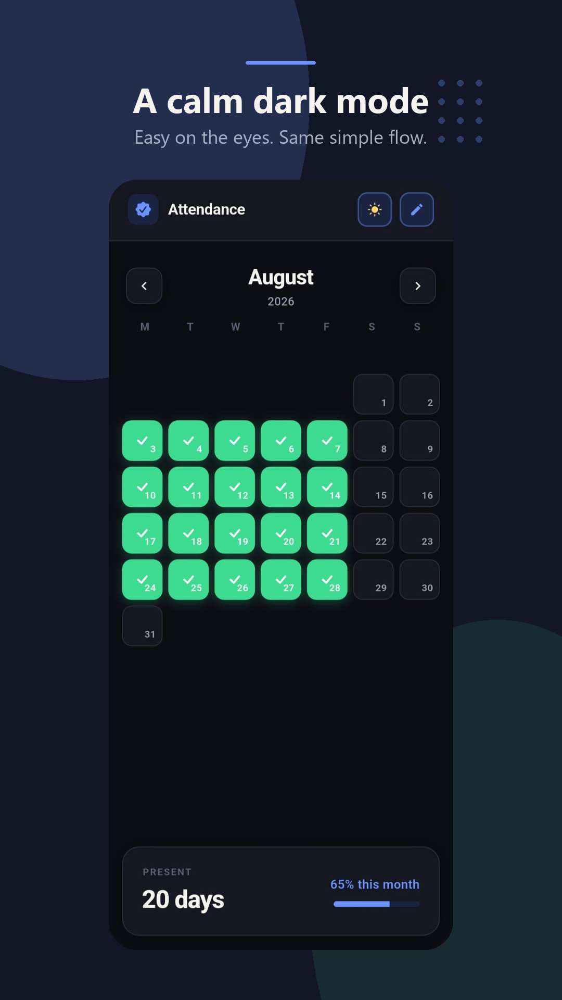

# AttendanceFlow

Flutter app for tracking daily attendance on a simple monthly calendar.

<p align="center">
  
  
</p>

## Features

- Monthly calendar with tap-to-mark attendance days
- Light and dark themes
- Edit mode for bulk corrections
- Local persistence via SharedPreferences
- Android and iOS targets

## Run

```bash
flutter pub get
flutter run
```

## Stack

- Flutter / Dart
- Material Design
- `shared_preferences` for offline storage
